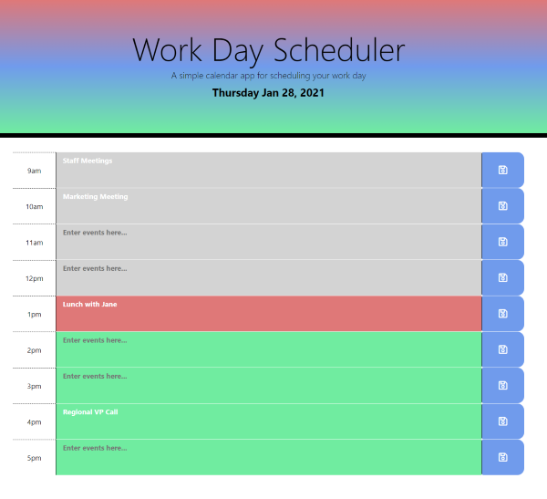
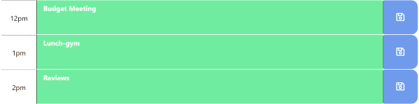

# Work Day Schedule
Calendar application to help the user manage tasks.

## You will find in this application
* Current date displayed in header by using Momentjs
* Rows to organize events within hour blocks
* Text fields that save input when the corresponding save button is clicked
* Dynamically updated row colors based on time of day

## Technologies
* HTML
* CSS
* Bootstrap 4
* JavaScript
* JQuery
* MomentJS
* Font Awesome

## Resources
* W3School
* MDN
* API documentation at JQuery.com
* stackOverflow
* Momentjs documents
* Font Awesome

## Links
* URL: https://shaylastevenson.github.io/day-planner/
* Github repo: https://github.com/ShaylaStevenson/day-planner

